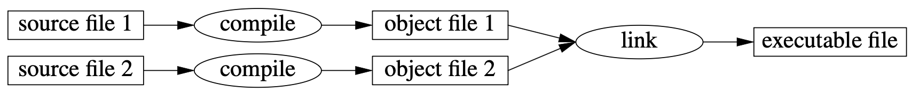
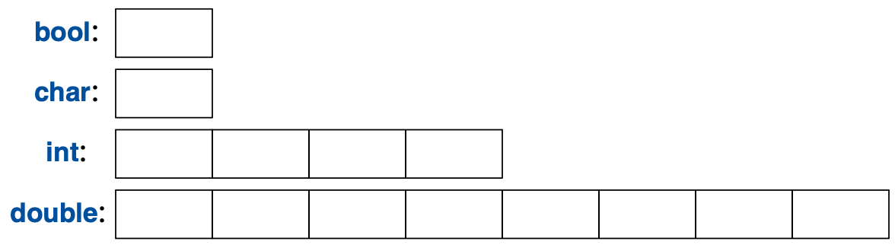
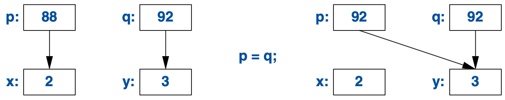
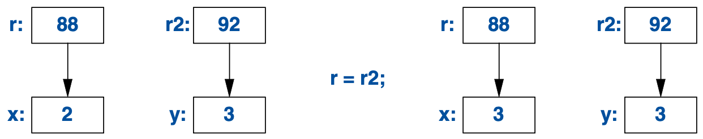

# 1. The Basics

## 1.1 Introduction

### Code

[hello_world.cpp](code/hello_world.cpp)

## 1.2. Programs



## 1.3 Functions

### Code

[square.cpp](code/square.cpp)

## 1.4 Types, Variables, and Arithmetic



```cpp
auto x = 5; // type inference
```

### Code

[types.cpp](code/types.cpp)

## 1.5 Scope & Lifetime

```cpp
vector<int> vec; // global

struct Record {
  string name; // member
  // ...
}

void foo(int arg) {
  string s = "hello"; // local
  // ...
}
```

## 1.6 Constants

```cpp
double sum(const vector<double>&);

vector<double> vec = {1.0, 2.0, 3.0}; // non-constant
const double sum = sum(vec);          // constant
```

```cpp
constexpr double square(double x) {
  return x * x;
}

constexpr double x = square(2.0); // evaluated by compiler
```

## 1.7 Pointers, Arrays, and References

```cpp
char arr[10];
char* ptr = &arr[5]; // pointer
char val = *ptr;     // dereference
```

```cpp
void sort(vector<double>& vec);        // reference
double sum(const vector<double>& vec); // const reference
```

```cpp
int* ptr = nullptr;
```

There is no "null reference". A reference must refer to a valid object.

### Code

[pointers.cpp](code/pointers.cpp)

## 1.8 Tests

```cpp
if (auto n = vec.size(); n != 0) {
  // ... n != 0
}
```

```cpp
if (auto n = vec.size()) {
  // ... n != 0
}
```

### Code

[switch.cpp](code/switch.cpp)

## 1.9 Mapping to Hardware

```cpp
int x = 2;
int y = 3;
int* p = &x;
int* q = &y;
p = q;
```



```cpp
int x = 2;
int y = 3;
int& r = x;
int& r2 = y;
r = r2;
```


