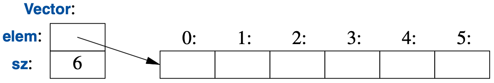

2. User-Defined Types

## 2.1 Introduction

## 2.2 Structures

```cpp
void f(Vector v, Vector& v_ref, Vector* v_ptr) {
  int size1 = v.size;
  int size2 = v_ref.size;
  int size3 = v_ptr->size;
}
```

### Code

[structs.cpp](code/structs.cpp)

## 2.3 Classes



### Code

[classes.cpp](code/classes.cpp)

## 2.4 Unions

[unions.cpp](code/unions.cpp)

[variants.cpp](code/variants.cpp)

## 2.5 Enumerations

```cpp
enum class Color {
  RED,
  GREEN,
  BLUE
};

enum class TrafficLight {
  GREEN
  YELLOW,
  RED
};

Color c = Color::RED;               // strongly typed
TrafficLight t = TrafficLight::RED; // strongly typed
```

### Code

[enums.cpp](code/enums.cpp)
