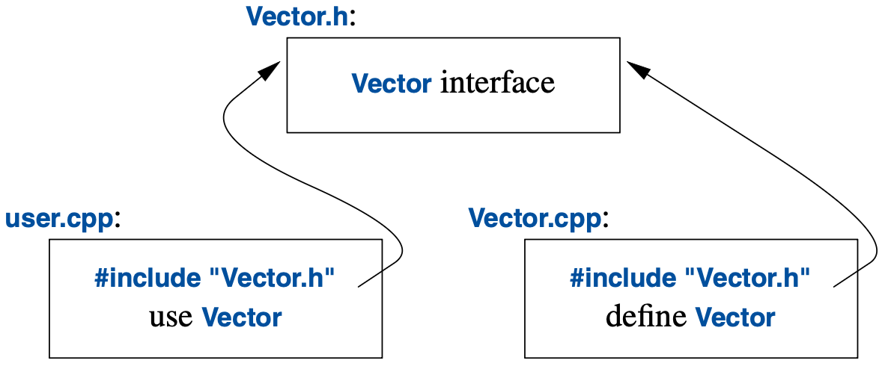

# 3. Modularity

## 3.1 Introduction

## 3.2 Separate Compilation

### Code

[headers/example.cpp](code/headers/example.cpp)

## 3.3 Modules

### Code

[modules/example.cpp](code/modules/example.cpp)

## 3.4 Namespaces

### Code

[namespaces.cpp](code/namespaces.cpp)

## 3.5 Error Handling

### Code

[exceptions.cpp](code/exceptions.cpp)

## 3.6 Function Arguments and Return Values

### Code

[argument_passing.cpp](code/argument_passing.cpp)

[structured_binding.cpp](code/structured_binding.cpp)
