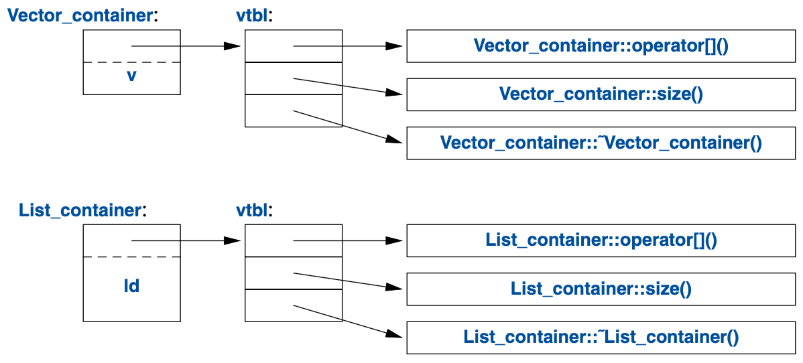

# 4. Classes

## 4.1 Introduction

## 4.2 Concrete Types

> The technique of acquiring resources in a constructor and releasing them in a destructor, known as **Resource Acquisition Is Initialization** or **RAII**, allows us to eliminate naked new operations, that is, to avoid allocations in general code and keep them buried inside the implementation of well-behaved abstractions. Similarly, naked delete operations should be avoided.

### Code

[complex.cpp](code/complex.cpp)

[vector.cpp](code/vector.cpp)

## 4.3 Abstract Types

[container.cpp](code/container.cpp)

## 4.4 Virtual Functions



### Hierarchy Navigation

```cpp
Shape* shape = read_shape(cin);

if (Smiley* smiley = dynamic_cast<Smiley*>(shape)) {
  // do something
}
```

### Avoiding Resource Leaks

```cpp
class Smiley : public Circle {
  // ...
private:
  vector<unique_ptr<Shape>> eyes;
  unique_ptr<Shape> mouth;
};

enum class Kind { circle, triangle, smiley };

unique_ptr<Shape> read_shape(istream& is) {
  // ...
  switch (kind) {
  case Kind::circle:
    // ...
    return unique_ptr<Shape>(new Circle(p, r));
  // ...
  }
}

void user() {
  vector<unique_ptr<Shape>> v;

  while (cin) {
    v.push_back(read_shape(cin));
  }

  draw_all(v);
  rotate_all(v);

} // all Shapes implicitly destroyed
```
