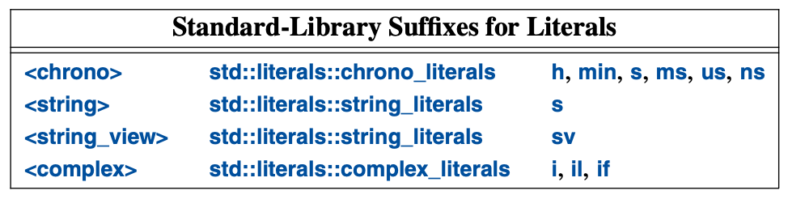

# 5. Essential Operations

## 5.1 Introduction

### Essential Operations

```cpp
class X {
public:
  X();                    // default constructor
  X(const X&);            // copy constructor
  X(X&&);                 // move constructor
  X& operator=(const X&); // copy assignment: clean up target & copy
  X& operator=(X&&);      // move assignment: clean up target & move
  ~X();                   // destructor
  // ...
};
```

```cpp
class Y {
public:
  Y();
  Y(const Y&) = default; // default copy constructor
  Y(Y&&)      = default; // default move constructor
  // ...
}
```

```cpp
class Shape {
public:
  Shape(const Shape&)            = delete; // no copy operations
  Shape& operator=(const Shape&) = delete;
  // ...
};
```

### The Rule of Zero

> Either define all of the essential operations or none

### Implicit Conversions

```cpp
complex z1 = 3.14;   // z1 becomes {3.14, 0.0}
complex z2 = z1 * 2; // z2 becomes {6.28, 0.0}
```

### Explicit Conversions

```cpp
class Vector {
public:
  explicit Vector(int s);
  // ...
};
```

```cpp
Vector v1(7);  // OK: v1 has 7 elements
Vector v2 = 7; // error: no implicit conversion from int to Vector
```

### Member Initializers

```cpp
class complex {
  double re = 0;
  double im = 0;
public:
  complex(double r, double i) : re(r), im(i) {}
  complex(double r) : re(r) {}
  complex() {}
  // ...
};
```

## 5.2 Copy & Move

```cpp
void test(complex z1) {
  complex z2 {z1}; // copy initialization
  complex z3;
  z3 = z2;         // copy assignment
  // ...
}
```

### Copying Containers

```cpp
// copy constructor
Vector::Vector(const Vector& a) : elements(new double[a.size]), size(a.size) {
  for (int i = 0; i < a.size; i++) {
    elements[i] = a.elements[i];
  }
}

// copy assignment
Vector& Vector::operator=(const Vector& a) {
  double* p = new double[a.size];

  for (int i = 0; i < a.size; i++) {
    p[i] = a.elements[i];
  }

  delete[] elements;

  elements = p;
  size = a.size;

  return *this;
}
```

### Moving Containers

```cpp
// move constructor
Vector::Vector(Vector&& a) : elements(a.size), size(a.size) {
  a.elements = nullptr;
  a.size = 0;
}
```
## 5.3 Resource Management

## 5.4 Conventional Operations

- ==, !=, <, <=, >, >=
- size(), begin(), end()
- \>\>, <<
- user-defined literals
- swap()
- hash()

### Comparisons

- when defining ==, also define != and make sure that a != b means !(a == b)
- when defining <, also define <=, >, >=, and make sure that:
  - a <= b means (a < b) || (a == b) and !(b < a)
  - a > b means b < a
  - a >= b means (a > b) || (a == b) and !(a < b)

#### Binary Operators

```cpp
namespace NX {
  class X {
    // ...
  };

  bool operator==(const X&, const X&);

  // ...
}
```

### Container Operations

```cpp
for (auto p = c.begin(); p != c.end(); ++p) {
  *p = 0;
}

for (auto& x : c) {
  x = 0;
}
```

### User-Defined Literals



```cpp
constexpr complex<double> operator""i(long double arg) {
  return {0, arg};
}

complex<double> z = 2.7182818 + 6.283185i;
```
